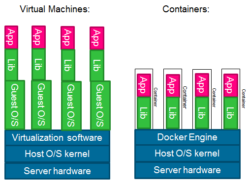
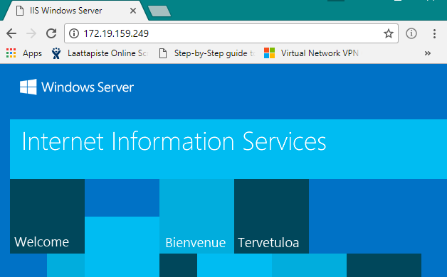

# Microsoft Build 2017: Windows Containers your way
**This year Solita sent a two-man strike team to Microsoft Build at Seattle in the beginning of May. There wre a lot of takeaways from the conference, but what I found was most intriguing was Windows Containers. There were both conference sessions and an additional pre-day training session that focused on Windows Containers and this blog is mainly based on those.**

## Build 2017

The conference was a three-day run packed with sessions. This year Build boasted xxxxx to yyyy participants, depending on the source. Also, this year the weather gods merciful and we enjoyed sunny weather in usually rainy Seattle. 

_MSBuild Keynote day 1_

As is the tradition, the queues were long in the conference and while we're complaining, we might as well say that the food was a bit of disappointment :). Then again, the informational content in the sessions was exceptional, so one may as well 'suffer' a few minute nuisances for it :).

But that's enough about the conference. About Containers:

## Docker containers

Microsoft has been now co-operating with Docker for some time in order to bring Windows into the Container space. This includes big changes in the Windows Kernel to make it Container-compatible and also large investments in the Azure infrastructure and tooling to make it the best Container platform in the existence. 

## Container crash course

Docker Containers are sort of new thing for the Microsoft ecosystem developers. My first run in with them was when Microsoft demoed a .NET app running inside a Windows container during Build 2015. So, sort of, like many other .NET developers, I'm just beginning my Docker journey.

Short recap: Containers are the next evolutionary step in virtualization technology. While the current virtualization technology enables IT departments to run multiple operating systems inside another operating system on top of single hardware, containers _share_ the host operating system. Or the kernel at least. This means that we do not have to duplicate the guest O/S in containers as we have to it today with virtual machine images. A container does not include a full O/S, but instead only the settings and libraries that are needed for the app the run. This is illustrated in the image below:

The virtualization technology back in the 2000s was revolutionary for IT departments as it allowed them to deploy apps more densily on the same hardware. Containers continue take this trend even further, as containers can be deployed even more densily as the containers have a much smaller footprint in terms of size when compared to a VM image. 

However, the virtualization technology from the 2000s did not affect developers directly. Containers do as they change how software is developed and also deployed.

## Why care about containers?

So why should a .NET developer care about containers? Here's a few reasons
* **Microservice architecture.** When talking about real microservice architecture (opposed to something that's actually just renamed Service Oriented Architecture) Docker containers help to manage the development environment where there's multiple microservices, each of which have their own database. This can be done without containers too, but they do ease up the job
* **"Works on my machine"** is something that we've all heard of and well... said also. Containers ease up the pain as the development time testing can be done within exact same kind of environment as the production environment. Because containers contain not only the app but also the environment that the app runs in.
* **Scripting**. Windows Containers are running a version of Windows Server 2016 that has no GUI. This means that all the O/S configuration has to be scripted. I.e. Docker containers force configuration through code, no more clickity clikcity from the GUI anymore. Personally I think this is where Windows Server environments should be heading and are heading, containers or not.
* **Operating system updates**. Need a fresh batch of operating system updates? No problem, pull a new Windows Server 2016 image from the Docker repository, rebuild your container and deploy it along your code changes. No more rebooting on guest O/S patching.

Additionally, the main driver on the DevOps side of things is that containers can be deployed more densily than traditional VM's. Which means that more apps can run on the same hardware than before. Also, Containers offer a clear interface of the app. The App comes within the container.

## Windows Containers vs. Hyper-V containers

So far we've been mostly talking about Windows Containers. However, in the Windows Container ecosystem you've actually two options how to run containers.  The Windows Container, in which the containers share the container host kernel. Another option is a Hyper-V container. In the latter model Windows creates a Hyper-V VM in between the Host kernel and container, thus providing more isolation from the actual Host o/s. This is useful especially in a multi-tenant environment, where you don't necessary fully trust all your tenant apps. Also, Windows 10 always runs Windows Containers through Hyper-V.

     
    <i>Hyper-V Container stack</i>

## Getting started and demo

You need a Windows Server 2016 or a Windows 10 Anniversary Edition or Creators Update (Professional or Enterprise). If you want to try out the Server 2016 version and plain Windows Containers, just fire a up VM. Locally or from the cloud. For Windows 10 there's en excellent getting started guide [here](https://docs.microsoft.com/en-us/virtualization/windowscontainers/quick-start/quick-start-windows-10).

Once you've got Docker container running, Powershell is your friend. Lets get started:

This creates a new container from Microsoft's micrsoft/iis image and runs it. 

-d says that we'll detach from the container after it's started and leave it running. 

-p 80:80 says that we'll map the host machine's port 80 to container's port 80. This allows us to access the container website also outside this machine.

Container List tells us that the container is still running in the background. In order to access the website from the current host machine, we need to go through some hoops. You see, the "localhost" loop back does not yet work with Windows Containers (this is explained excellently [here](https://blog.sixeyed.com/published-ports-on-windows-containers-dont-do-loopback/), so first we need to actually find the IP  that our host gave to the container:

And finally, if we browse to that IP, we can access the container from our machine and see the familiar IIS start page:

## The Now and the Future for Windows Containers

During Autumn 2014 Microsoft announced that the Docker containers are coming to the Windows ecosystem and the first Docker container running on top of Windows Server was shown on Build 2015 half a year later. 

